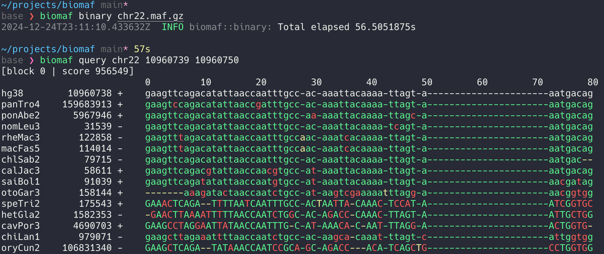

[](https://github.com/vsbuffalo/maftk/actions/workflows/ci.yml)

# maftk (formerly biomaf) — experimental MAF parser and toolkit in Rust 🦀




A very small Multiple Alignment Format (MAF) parsing library and tool in Rust.

Subcommands:

  - `maftk split`: Split a chromosome's MAF file into a series of MAF files
    per region alignment.
  - `maftk binary <in.maf.gz>`: indexes and serializes the alignment blocks using [hgindex](https://github.com/vsbuffalo/hgindex).
  - `maftk query chr22 10960739 10960750`: queries the binary alignment blocks using fast hierarchical indexing.
  - `maftk stats --species 'hg38,panTro4' refgene_chr22.bed --output results.tsv`: calculate alignment statistics within regions.

## Installation

For now, this isn't on [crates.io](http://crates.io). So, use:

```
$ cargo install --git https://github.com/vsbuffalo/maftk
```

## Notes

Compressing the raw sequence alignment block is fairly significant advantages:

```
$ ll maf.mmdb     # without compression
-rw-r--r--@  1 vsb  staff   2.9G Jan 11 15:41 chr21.bin
-rw-r--r--@  1 vsb  staff   2.6G Jan 11 15:42 chr22.bin

$ ll maf.mmdb    # with compression
total 4843552
-rw-r--r--@  1 vsb  staff   1.1G Jan 11 16:21 chr21.bin
-rw-r--r--@  1 vsb  staff   1.2G Jan 11 16:23 chr22.bin
```

Which is about a 2.4x compression ratio, or files are about 42% of their
original size.
